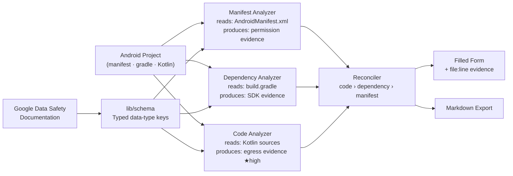

# Consent — Android Data Safety Autofill

Analyzes an Android project's manifest, Gradle dependencies, and Kotlin
source to pre-fill Google Play's Data Safety form with file-and-line
evidence for every answer.

**Live:** https://data-safety-autofill.vercel.app

---

## The problem

Every Android app published on Google Play must complete the Data Safety
form. Inaccurate answers can result in app suspension. The form asks
developers to declare data collected not only by their own code but also
by third-party SDKs — libraries the developer did not write and cannot
easily audit. Google's policy documentation states this requirement
explicitly.

The result is that developers are asked to commit to answers they do not
have evidence for.

---

## Measuring the problem

Before building anything, I filled the form by hand for `ne-prospi`, my
own alarm clock app. Figures from [`eval/baseline.md`](eval/baseline.md):

| Metric | Value |
|---|---|
| Time | 17 min 57 sec |
| Data types evaluated | 28 of 28 |
| Marked as collected | **11** |
| Of those, at confidence 1–2 (guesses) | **6** — 55% of affirmative answers |

More than half of the affirmative answers were guesses. The 18-minute
figure is also a floor: the template used here asked only "collected or
not". The real Play Console form adds follow-up questions for every
collected type — purpose, optionality, sharing, ephemerality.

---

## Results

Full data in [`eval/comparison.md`](eval/comparison.md).

**Of the 11 types I marked collected by hand, 9 were false positives.**
The tool resolved all 6 uncertain answers (confidence 1–2) — and in every
case the correct answer was "not collected":

| Data type | My answer | Tool answer |
|---|---|---|
| Files and docs | 2 — guessed collected | Not collected — no `READ_EXTERNAL_STORAGE` in manifest |
| Calendar events | 1 — guessed collected | Not collected — no `READ_CALENDAR`, no `CalendarContract` |
| App interactions | 1 — guessed collected | Not collected — `POST_NOTIFICATIONS` downgraded, no analytics SDK |
| In-app search history | 2 — guessed collected | Not collected — `SearchPanel.kt` stores no history |
| Installed apps | 2 — guessed collected | Not collected — no `getInstalledPackages` call |
| Diagnostics | 2 — guessed collected | Not collected — `Log.*` calls are local; no reporting SDK |

The tool also resolved three of my confident wrong answers (other in-app
messages, music files, other app performance data).

**On `mesh-network`** the dependency analyzer found 2 data types visible
only through `play-services-nearby` — **Device or other IDs** and **Other
actions**. Neither appears anywhere in the app's own source; both come
from the SDK, which is exactly the case Google's policy requires the
developer to declare and the hardest case to catch by reading your own
code.

**Where the tool is wrong.** Section 3f of `comparison.md` documents a
confirmed false positive: `Lang.kt` line 42 calls `TelephonyManager` to
read `networkCountryIso` for distance-unit display (km vs miles). The code
analyzer fires on any use of `TelephonyManager` and flags
`deviceOrOtherIds` as `needsReview`. The `needsReview` hedge is the
correct behavior — the tool flags it for human review rather than asserting
collection — but the underlying regex is too broad. The manual answer (not
collected) is right.

**Net scorecard for `ne-prospi`** (28-type overlap):

| | Manual | Tool |
|---|---|---|
| False positives | 9 | 1 |
| Precision | 9% | 67% |
| Time | 17 min 57 sec | 27 ms |

---

## How it works



Three analyzers run in parallel against the same project, each producing
findings backed by at least one file-and-line evidence entry. The
reconciler then merges them using a fixed priority rule: real egress found
in Kotlin source takes precedence over an SDK lookup in `build.gradle`,
which in turn takes precedence over a declared permission in the manifest;
a manifest-only signal with no supporting code or dependency resolves to
`collected: false`, never `needsReview`.

Full notes: [`docs/architecture.md`](docs/architecture.md)

---

## How IBM Bob was used

- **`/init`** generated `AGENTS.md` on the first session, giving every
  subsequent session immediate project context without re-reading the
  codebase.
- **Document understanding** — I uploaded Google's Data Safety
  documentation and asked Bob to extract the 38 data-type keys and their
  triggering signals into `lib/schema/data-safety-schema.ts`, which became
  the single source of truth for all three analyzers.
- **Three analyzers as parallel subagents** — manifest, dependency, and
  code analyzers were each scaffolded in a separate Bob task, running
  concurrently without context bleed between them.
- **Real-code validation** — running each analyzer against real sources,
  rather than trusting its test suite, caught a defect the tests did not.
  The first code analyzer reported that the alarm clock collects photos:
  every piece of evidence pointed at `CameraManager.setTorchMode`, because
  the app uses the camera API as a flashlight. It was also asserting
  collection from API reads with no proof of egress. Both were fixed, and
  the camera rule now matches only capture APIs.

  A second false positive — `TelephonyManager` read for a country code —
  is documented in section 3f and **has not been fixed**. The regex still
  matches any use of the class. It is recorded rather than quietly
  resolved, because it is the one case where the manual answer beat the
  tool.

---

## Running locally

```bash
npm install
npm run dev        # http://localhost:3000
npm test           # 41 tests, ~550 ms
npx vercel         # deploy
```

No database, no auth, no external API calls. Everything runs in the
browser or on Vercel's edge.
