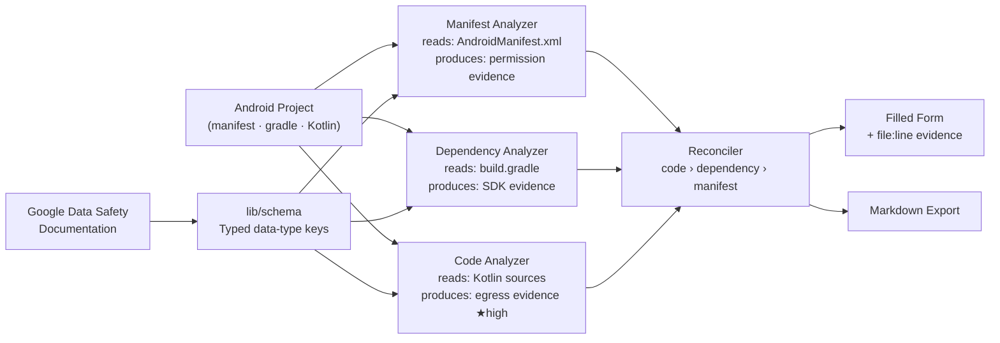

# IBM Bob 2.0 Hackathon — 25–27 сентября 2026

## Consent — Pipeline Architecture



Each finding carries at least one file-and-line evidence entry so every
form answer is traceable to source code or configuration.  When the same
data type is detected by multiple analyzers the reconciler applies the
priority rule **code › dependency › manifest**: real egress in Kotlin
source outweighs an SDK lookup in `build.gradle`, which outweighs a
declared permission in the manifest; a manifest-only signal with no
code or dependency support resolves to `collected: false`.

> Full architecture notes: [docs/architecture.md](docs/architecture.md)

---

Тема: **Build with purpose using IBM Bob 2.0** — улучшить конкретный
workflow разработчика (онбординг, дебаг, код-ревью, тестирование,
поддержка, релиз/деплой).

## Правила допуска к судейству

1. **Bob IDE — обязателен** как ключевой компонент решения. Фреймворки и
   технологии — любые, но Bob должен быть виден в архитектуре.
2. **Папка [`bob_sessions/`](bob_sessions/)** со скриншотами task session
   summary — обязательный деливерабл. Снимай по ходу работы, не в
   воскресенье вечером.
3. **Свои данные**, без клиентских/конфиденциальных/персональных данных и
   без соцсетей. Реестр источников — в [`DATA_SOURCES.md`](DATA_SOURCES.md).

## Бюджет Bobcoins — соло, 40 монет, добавки не будет

Участие соло: пула команды нет, 40 Bobcoins на все 48 часов. Это главное
ограничение проекта — планируй под него, а не под время.

- Проверка: Bob IDE → **Settings** → **General**
- Или: https://bob.ibm.com/admin/subscription
- Аккаунт должен быть **`ibm-coding-challenge-uat` (регион `us-east`)**,
  а не личный/trial.
- Если кончились — остаются watsonx Orchestrate и watsonx.ai.

### Как не сжечь бюджет

- **Разогрев — на trial-аккаунте, не на хакатонном.** Бесплатный триал даёт
  свои 50 монет. Упражнения из гайда пройди на нём сегодня; завтра
  переключись на `ibm-coding-challenge-uat` уже разогретым.
- **`/init` один раз** в начале — сгенерит `AGENTS.md`, и Bob перестанет
  заново разбирать проект в каждой новой сессии.
- **Ask mode для вопросов, Agent mode — только когда правда нужно писать код.**
- **Plan → Code.** Сначала план в Plan mode, потом исполнение. Дешевле, чем
  агент, который пошёл не туда и переделывает.
- **`.bobignore`** на `node_modules`, `dist`, датасеты — меньше контекста.
- **Новый контекст** вместо бесконечной ветки — длинная история дорожает.
- Сверяйся с процентом в Settings → General после каждого крупного таска.

### Соло-стратегия по скоупу

Судят измеримый эффект на конкретном workflow, а не размер проекта. Соло
выгоднее узкая задача, доведённая до конца и с цифрами «было/стало», чем
широкая платформа наполовину. Возьми **один** сценарий из списка ниже.

## Скриншот сессии за 10 секунд

```bash
powershell -File tools/new-session-shot.ps1 -Team myteam -Task 1 -Desc login_flow
```

`-Team` достаточно указать один раз — запомнится.

## Идеи из гайда

- Smart developer onboarding assistant — разбор репозитория, объяснение
  архитектуры, генерация setup-инструкций, стартовые задачи
- Intelligent code review coach — риски, объяснения, фиксы, саммари ревью
- Automated testing hub — генерация юнит-тестов, дыры в покрытии
- Release readiness assistant — зависимости, риски, release notes
- Legacy modernization accelerator — объяснение старого кода, миграция

Сильные сабмишены используют Agent mode, parallel tasks, subagents и
document understanding — не просто автокомплит. Показывай измеримый эффект:
меньше ручной работы, меньше ошибок, часы → минуты.

## Ссылки

- [Гайд хакатона](https://lablab-ibm-bob-2-hackathon-guide.s3.us.cloud-object-storage.appdomain.cloud/index.html)
- [Документация Bob IDE](https://bob.ibm.com/docs/ide/getting-started/quickstart)
- [Best practices](https://bob.ibm.com/docs/ide/getting-started/best-practices)
- [Упражнения для разогрева](https://bob.ibm.com/docs/ide/getting-started/tutorials/introduction)
- [Admin dashboard (Bobcoins)](https://bob.ibm.com/admin/subscription)
