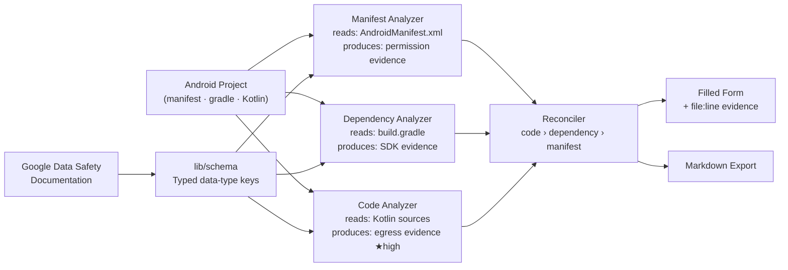

# Architecture — Consent Pipeline

Each finding is backed by at least one `evidence` entry (file path + line
number), so every answer on the form is traceable to a specific line of
source code or configuration.

**Evidence priority rule.** When multiple analyzers detect the same data
type, the reconciler trusts the most direct signal: real egress found in
Kotlin source takes precedence over an SDK lookup in `build.gradle`, which
in turn takes precedence over a declared permission in the manifest. A
manifest-only signal with no supporting code or dependency resolves to
`collected: false`, never `needsReview`.
